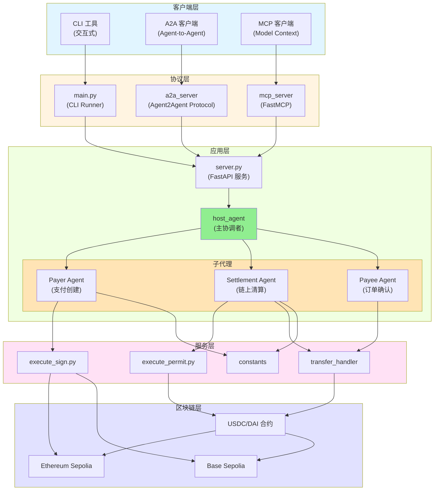

# Zen7 Payment Agent - 开发指南

> 面向开发者的完整指南，帮助理解、配置并扩展 Zen7 Payment Agent 系统。

---

## 目录

1. [环境配置](#1-环境配置)
2. [系统架构概览](#2-系统架构概览)
3. [代码结构详解](#3-代码结构详解)
4. [快速开始](#4-快速开始)
5. [开发工作流](#5-开发工作流)
6. [扩展指南](#6-扩展指南)

---

## 1. 环境配置

### 1.1 先决条件

| 组件 | 最低版本 | 用途 |
| --- | --- | --- |
| 操作系统 | Windows 10+ / Ubuntu 20.04+ | 开发环境（Windows 建议使用 WSL2） |
| Python | 3.13.x | 项目运行时解释器 |
| uv | 0.4.18+ | 虚拟环境与依赖管理 |
| Git | 2.40+ | 仓库克隆与版本控制 |
| OpenSSL | 1.1+ | 加密操作与签名生成 |

> **提示**：`uv` 包管理器会自动下载并管理兼容的 CPython 版本，无需手动安装 Python。

### 1.2 工具安装

#### 安装 uv 包管理器

**Linux/macOS：**
```bash
curl -LsSf https://astral.sh/uv/install.sh | sh
```

**Windows（PowerShell）：**
```powershell
irm https://astral.sh/uv/install.ps1 | iex
```

#### 启用 Python 版本管理
```bash
uv python install 3.13
```

#### 验证安装
```bash
uv --version
uv python --version
```

### 1.3 项目初始化

#### 克隆仓库
```bash
git clone https://github.com/Zen7-Labs/Zen7-Payment-Agent.git
cd Zen7-Payment-Agent
```

#### 创建虚拟环境
```bash
# 创建隔离环境（.venv 目录）
uv venv

# 激活环境
# Linux/macOS:
source .venv/bin/activate
# Windows PowerShell:
\.\.venv\Scripts\Activate.ps1

# 安装项目依赖
uv sync
```

> 依赖来源包括阿里云镜像与官方 PyPI，可在 `pyproject.toml` 中调整。

### 1.4 环境变量

#### 创建配置文件
```powershell
# 拷贝模板
Copy-Item .env.example .env -Force
```

#### 核心配置项

| 变量 | 是否必填 | 说明 |
| --- | --- | --- |
| `GOOGLE_API_KEY` | ✅ | Gemini 模型使用的 Google Generative AI 访问密钥 |
| `GOOGLE_GENAI_USE_VERTEXAI` | ⬜ | 是否启用 VertexAI（`TRUE`/`FALSE`） |
| `PAYER_PRIVATE_KEY` | ✅ | 付款方签名私钥（仅限测试网） |
| `SETTLEMENT_PRIVATE_KEY` | ✅ | 清算私钥（仅限测试网） |
| `SPENDER_WALLET_ADDRESS` | ✅ | 授权花费方的钱包地址 |
| `ZEN7_PAYMENT_SERVER_HOST` | ✅ | FastAPI 服务绑定地址（默认 `localhost`） |
| `ZEN7_PAYMENT_SERVER_PORT` | ✅ | FastAPI 服务端口（默认 `8080`） |
| `CHAIN_SELECTION` | ✅ | 目标区块链网络（`SEPOLIA` 或 `BASE_SEPOLIA`） |
| `SEPOLIA_CHAIN_RPC_URL` | ✅ | Ethereum Sepolia RPC 端点（Infura/Alchemy） |
| `SEPOLIA_USDC_ADDRESS` | ✅ | 测试网 USDC 合约地址 |
| `SEPOLIA_DAI_ADDRESS` | ⬜ | 测试网 DAI 合约地址（若使用 DAI） |
| `BASE_SEPOLIA_CHAIN_RPC_URL` | ⬜ | Base Sepolia RPC 端点（若使用 Base 网络） |
| `BASE_SEPOLIA_USDC_ADDRESS` | ⬜ | Base Sepolia USDC 合约地址 |
| `NOTIFICATION_URL` | ⬜ | 支付结果回调通知地址 |
| `ACTIVE_TOKEN` | ✅ | 当前使用的支付代币（`USDC` 或 `DAI`） |

> **安全警告**：切勿在生产环境使用真实私钥。请使用密钥管理服务或 CI/CD 机密注入来管理敏感信息。

---

## 2. 系统架构概览

### 2.1 高层架构

Zen7 Payment Agent 基于谷歌 ADK（Agent Development Kit）的多代理体系，并同时支持 A2A 与 MCP 等多种协议接口。

#### 架构图



### 2.2 核心组件

#### 2.2.1 多代理系统

**Host Agent**（`host_agent/agent.py`）
- 支付流程的主协调者
- 将请求路由至各专业子代理
- 维护对话历史与会话状态
- 使用 `gemini-2.0-flash-lite` 模型进行自然语言理解

**子代理：**

1. **Payer Agent**（`host_agent/sub_agents/payer_agent/`）
   - 创建包含订单号、支付金额、预算、有效期、币种等信息的支付请求
   - 生成用于授权的 EIP-712 签名
   - 校验钱包余额与 nonce
   - 将支付提交给清算流程

2. **Settlement Agent**（`host_agent/sub_agents/settlement_agent/`）
   - 确认支付详情（预算、有效期、币种）
   - 执行链上清算交易
   - 监控交易状态与确认数
   - 清算成功后通知收款方代理

3. **Payee Agent**（`host_agent/sub_agents/payee_agent/`）
   - 接收清算通知
   - 确认订单创建
   - 通知支付发起方流程完成

#### 2.2.2 协议适配器

**A2A（Agent-to-Agent）服务器**（`a2a_server/`）
- 使用 `A2AStarletteApplication` 实现谷歌 A2A 协议
- 通过 `AgentCard` 暴露可发现的代理能力
- 支持代理间通信与协作
- 默认端口：10000

**MCP（Model Context Protocol）服务器**（`mcp_server/`）
- 使用 `FastMCP` 将支付能力封装为工具型 API
- 提供 `proceed_payment_and_settlement_detail_info` 工具
- 支持 SSE（Server-Sent Events）传输
- 默认端口：8015

#### 2.2.3 服务层

**签名服务**（`services/execute_sign.py`）
- 实现 USDC/DAI 授权的 EIP-712 类型数据签名
- 校验私钥、nonce 与代币余额
- 生成包含截止时间与金额的授权签名
- 同时支持 Ethereum 与 Base Sepolia 网络

**转账处理器**（`services/custodial/` 与 `services/non_custodial/`）
- 托管模式：后端托管钱包操作
- 非托管模式：用户自持私钥
- 负责执行授权与代币转账

**常量配置**（`services/constants.py`）
- 集中管理区块链配置
- 包含链 ID、RPC URL、合约地址
- 定义各网络特定参数

### 2.3 数据流

#### 支付创建流程
```
用户请求 → Host Agent → Payer Agent →
生成 EIP-712 签名 → 返回签名 →
更新会话状态 → 通知用户
```

#### 清算流程
```
清算请求 → Settlement Agent →
校验支付详情 → 执行链上交易 →
监控确认 → 通知 Payee Agent →
创建订单 → 返回确认结果
```

---

## 3. 代码结构详解

### 3.1 顶层目录结构

| 路径 | 角色 | 说明 |
| --- | --- | --- |
| `main.py` | CLI 入口 | 使用 Google ADK Runner 的本地调试交互式命令行工具 |
| `server.py` | FastAPI 服务 | 暴露 `/chat_a2a` 接口供外部集成 |
| `cli.py` | CLI 工具集 | 命令行参数解析与实用工具 |
| `utils.py` | 通用工具 | 会话历史管理、事件处理、终端格式化 |
| `log.py` | 日志配置 | 集中式日志器，包含文件与控制台处理器 |
| `run.sh` | 编排脚本 | 启动 FastAPI 及协议服务（A2A/MCP）的 Bash 脚本 |
| `run.ps1` | PowerShell 脚本 | Windows 平台的等效编排脚本 |
| `pyproject.toml` | 依赖管理 | 项目元数据与依赖声明（由 `uv` 管理） |
| `requirements.txt` | 传统依赖表 | 兼容性需求保留的 pip 依赖列表 |

### 3.2 入口文件与应用层

#### 3.2.1 `main.py` - 交互式 CLI

```python
关键组件：
- InMemorySessionService：管理会话状态与对话历史
- Runner：Google ADK 运行器负责代理执行
- 初始状态：order_number、spend_amount、budget、expiration_date、currency、sign_info
- 交互循环：接受用户输入，直到输入 'exit' 或 'quit'
- 历史管理：通过 utils 函数维护交互历史
```

**工作流程：**
1. 基于初始状态创建新会话
2. 使用 host_agent 初始化 Runner
3. 进入输入循环
4. 通过代理处理用户问题
5. 持续维护对话历史

#### 3.2.2 `server.py` - FastAPI 服务

```python
关键组件：
- FastAPI 应用：RESTful API 框架
- Lifespan 上下文：初始化共享会话服务与 Runner
- AppWideService：提供跨请求的共享资源
- 路由：
  - POST /chat_a2a：主要聊天端点
  - GET /sessions：列出所有会话
  - POST /sessions：创建新会话
  - GET /sessions/{session_id}：查询会话详情
  - DELETE /sessions/{session_id}：删除会话
```

**接口详情：**

**POST /chat_a2a**
```json
请求：
{
  "message": "string",
  "user_id": "string (optional)",
  "sign_info": "object (optional)",
  "owner_wallet_address": "string (optional)"
}

响应：
{
  "response": {
    "event": {...},
    "final_response": "string"
  }
}
```

### 3.3 代理架构

#### 3.3.1 Host Agent（`host_agent/agent.py`）

**配置：**
- 模型：`gemini-2.0-flash-lite`
- 子代理：payer_agent、settlement_agent、payee_agent
- 上下文：在提示中注入历史对话

**职责：**
1. 理解请求并路由到合适子代理
2. 跨子代理维护状态
3. 协调最终响应
4. 记录交互历史

#### 3.3.2 子代理结构

每个子代理都遵循以下模式：
```python
from google.adk.agents import Agent

agent = Agent(
    name="agent_name",
    model="gemini-2.0-flash-lite",
    description="Agent description",
    instruction="Detailed instructions...",
    tools=[tool_function_1, tool_function_2]
)
```

**Payer Agent 工具：**
- `create_payment_order`：初始化支付详情
- `generate_permit_signature`：生成 EIP-712 签名
- `validate_balance`：检查钱包余额与 nonce

**Settlement Agent 工具：**
- `confirm_payment_details`：校验支付参数
- `execute_settlement`：触发链上交易
- `monitor_transaction`：跟踪交易状态
- `notify_payee`：发送完成通知

**Payee Agent 工具：**
- `receive_notification`：接收清算通知
- `create_order`：在收款系统中创建订单
- `notify_initiator`：向支付发起方确认

### 3.4 协议适配层

#### 3.4.1 A2A Server（`a2a_server/`）

**agent.py：**
```python
process_with_content_agent：A2A 的代理包装
- 工具：proceed_payment_and_settlement_and_order_info
- 将请求发送至 ZEN7_PAYMENT_SERVER_BASE_URL 的 FastAPI 服务
```

**agent_executor.py：**
```python
ADKAgentExecutor：将外部 A2A 请求映射到 host_agent
- 实现 A2A 协议的执行器接口
- 处理状态管理与会话上下文
```

**__main__.py：**
```python
A2AStarletteApplication 配置：
- AgentCard：描述代理能力
- AgentSkill：定义可用技能
- Uvicorn 服务器：运行 A2A 协议服务
```

#### 3.4.2 MCP Server（`mcp_server/`）

**__main__.py：**
```python
FastMCP 应用：
- 工具：proceed_payment_and_settlement_detail_info
- 参数：message、user_id、sign_info、owner_wallet_address
- 传输方式：SSE（Server-Sent Events）
- Click CLI：用于服务器配置的命令行界面
```

### 3.5 服务层

#### 3.5.1 签名服务（`services/execute_sign.py`）

**核心功能：**
```python
1. EIP-712 类型数据结构：
   - Domain：name、version、chainId、verifyingContract
   - Types：Permit(owner, spender, value, nonce, deadline)
   - Message：实际授权参数

2. 签名生成：
   - 使用 eth_account 编码类型数据
   - 通过私钥签名
   - 返回 v、r、s 签名字段

3. 校验逻辑：
   - 私钥格式与长度
   - 钱包余额是否充足
   - 从合约获取 nonce
   - 截止时间转换
```

**支持代币：**
- USDC（版本 2）
- DAI（版本 1）

**支持网络：**
- Ethereum Sepolia（链 ID：11155111）
- Base Sepolia（链 ID：84532）

#### 3.5.2 常量配置（`services/constants.py`）

统一提供以下配置：
- 链 ID 及其十六进制表示
- RPC 端点 URL
- 代币合约地址
- 网络相关参数

#### 3.5.3 转账处理器

**托管模式**（`services/custodial/`）
- 后端钱包托管私钥
- 用户体验更简单
- 对信任要求更高

**非托管模式**（`services/non_custodial/`）
- 用户自主管理私钥
- 安全性更高
- 需要集成钱包

### 3.6 工具与日志

#### 3.6.1 `utils.py`

**关键函数：**

```python
add_user_query_to_history(session_id, user_input, session_service)
- 将用户消息追加到会话历史

update_interaction_history(session_id, role, content, session_service)
- 维护会话状态中的格式化历史记录

call_agent_async(runner, session_id, user_input)
- 封装 Runner.run_async 完成代理执行
- 处理流式事件
- 返回格式化响应

process_agent_response(event)
- 将 Event 转换为结构化响应
- 处理终端颜色格式
```

#### 3.6.2 `log.py`

**日志配置：**
```python
- 格式：[%(asctime)s] %(levelname)s - %(message)s
- 处理器：
  - 控制台：INFO 级别并支持彩色输出
  - 文件（logs/server.log）：DEBUG 级别
  - 错误文件（logs/errors.log）：ERROR 级别
- 轮转：日志按需滚动保留历史
```

### 3.7 脚本与编排

#### 3.7.1 `run.sh`（Bash）

```bash
用法：./run.sh [a2a|mcp] --host <host> --port <port>

特性：
- 协议选择的参数解析
- 自动协调服务启动顺序
- 环境变量注入
- 进程管理
```

#### 3.7.2 `run.ps1`（PowerShell）

Windows 版本的编排脚本，功能与 Bash 版本一致。

---

## 4. 快速开始

如需立即上手与首运行指导，请参阅专门的 [快速开始指南](quick_start.md)。

快速开始指南涵盖：
- 环境快速配置
- 仓库克隆与依赖安装
- 在 CLI、API、A2A、MCP 等模式下运行应用
- 首次支付交易示例
- 常见问题排查

---

## 5. 开发工作流

### 5.1 开发常用命令

| 任务 | 命令 |
| --- | --- |
| 启动交互式 CLI | `uv run python main.py` |
| 启动 FastAPI 服务 | `uv run python server.py` |
| 启动 A2A 服务器 | `uv run a2a_server --host 127.0.0.1 --port 10000` |
| 启动 MCP 服务器 | `uv run mcp_server --host 127.0.0.1 --port 8015` |
| 编排启动（A2A） | `./run.sh a2a --host 127.0.0.1 --port 10000` |
| 编排启动（MCP） | `./run.sh mcp --host 127.0.0.1 --port 8015` |

### 5.2 API 测试

#### 使用 cURL

```bash
# 与代理对话
curl -X POST http://localhost:8080/chat_a2a \
  -H "Content-Type: application/json" \
  -d '{"message": "Create a payment for order #12345 with amount 100 USDC"}'

# 列出全部会话
curl http://localhost:8080/sessions

# 创建新会话
curl -X POST http://localhost:8080/sessions \
  -H "Content-Type: application/json" \
  -d '{"user_id": "test_user"}'
```

#### 使用 Python Requests

```python
import requests

# 聊天端点
response = requests.post(
    "http://localhost:8080/chat_a2a",
    json={"message": "Create a payment for order #12345"}
)
print(response.json())
```

### 5.3 日志与调试

**日志文件：**
- `logs/server.log`：应用日志（DEBUG 级别）
- `logs/errors.log`：错误日志
- `run.log`：脚本执行日志

**启用详细日志：**
```python
# 在代码中
import logging
logging.getLogger().setLevel(logging.DEBUG)
```

**实时查看日志：**
```bash
# Linux/macOS
tail -f logs/server.log

# Windows PowerShell
Get-Content logs/server.log -Wait
```

### 5.4 测试

当前仓库尚未内置自动化测试，建议如下：

**添加 pytest：**
```bash
uv add --dev pytest pytest-asyncio httpx
```

**创建测试结构：**
```
tests/
  __init__.py
  test_agents.py
  test_services.py
  test_api.py
  conftest.py
```

**示例测试：**
```python
# tests/test_api.py
import pytest
from fastapi.testclient import TestClient
from server import app

client = TestClient(app)

def test_chat_endpoint():
    response = client.post(
        "/chat_a2a",
        json={"message": "Hello"}
    )
    assert response.status_code == 200
    assert "response" in response.json()
```

**运行测试：**
```bash
uv run pytest tests/
```

---

## 6. 扩展指南

### 6.1 新增子代理

1. **创建代理目录：**
```
host_agent/sub_agents/new_agent/
  __init__.py
  agent.py
```

2. **在 `agent.py` 中定义代理：**
```python
from google.adk.agents import Agent
from google.adk.tools import ToolContext

def custom_tool(param: str, tool_context: ToolContext) -> str:
    """工具实现"""
    return "result"

new_agent = Agent(
    name="new_agent",
    model="gemini-2.0-flash-lite",
    description="New agent description",
    instruction="Detailed instructions...",
    tools=[custom_tool]
)
```

3. **在 Host Agent 中注册：**
```python
# host_agent/agent.py
from .sub_agents.new_agent import new_agent

host_agent = Agent(
    name="host_agent",
    # ... 其他配置
    sub_agents=[payer_agent, settlement_agent, payee_agent, new_agent],
)
```

### 6.2 新增服务

1. **创建服务模块：**
```python
# services/new_service.py
from log import logger
from web3 import Web3

def new_service_function(param1, param2):
    """服务实现"""
    logger.info(f"Processing {param1}")
    # 具体实现
    return result
```

2. **在代理工具中使用：**
```python
from services.new_service import new_service_function

def agent_tool(param: str, tool_context: ToolContext) -> str:
    result = new_service_function(param, "value")
    return result
```

### 6.3 支持新链

1. **更新 `services/constants.py`：**
```python
# 新增链配置
NEW_CHAIN_ID = 123456
NEW_CHAIN_ID_HEX = hex(NEW_CHAIN_ID)
NEW_CHAIN_RPC_URL = os.getenv("NEW_CHAIN_RPC_URL")
NEW_CHAIN_USDC_ADDRESS = os.getenv("NEW_CHAIN_USDC_ADDRESS")
```

2. **更新 `.env.example`：**
```bash
# 新链配置
NEW_CHAIN_RPC_URL=https://rpc.newchain.io
NEW_CHAIN_USDC_ADDRESS=0x...
```

3. **增加链选择逻辑：**
```python
# services/constants.py
CHAIN_SELECTION = os.getenv("CHAIN_SELECTION", "SEPOLIA")

if CHAIN_SELECTION == "NEW_CHAIN":
    CHAIN_ID = NEW_CHAIN_ID
    CHAIN_RPC_URL = NEW_CHAIN_RPC_URL
    USDC_ADDRESS = NEW_CHAIN_USDC_ADDRESS
```

### 6.4 增加新代币支持

1. **配置代币参数：**
```python
# services/execute_sign.py
NEW_TOKEN_ADDRESS = os.getenv("NEW_TOKEN_ADDRESS")
NEW_TOKEN_NAME = "NewToken"
NEW_TOKEN_VERSION = "1"
```

2. **更新 EIP-712 域信息：**
```python
if ACTIVE_TOKEN == "NEW_TOKEN":
    USDC_ADDRESS = Web3.to_checksum_address(NEW_TOKEN_ADDRESS)
    USDC_NAME = NEW_TOKEN_NAME
    USDC_VERSION = NEW_TOKEN_VERSION
```

3. **添加代币校验逻辑：**
```python
def validate_token_balance(token_address, wallet_address, amount):
    token_contract = w3.eth.contract(address=token_address, abi=ERC20_ABI)
    balance = token_contract.functions.balanceOf(wallet_address).call()
    return balance >= amount
```

### 6.5 自定义协议适配器

若需支持 A2A、MCP 之外的其它协议：

1. **创建协议目录：**
```
custom_protocol_server/
  __init__.py
  __main__.py
  adapter.py
```

2. **实现适配器：**
```python
# custom_protocol_server/adapter.py
import requests
import os

class CustomProtocolAdapter:
    def __init__(self):
        self.base_url = f"http://{os.getenv('ZEN7_PAYMENT_SERVER_HOST')}:{os.getenv('ZEN7_PAYMENT_SERVER_PORT')}"
    
    def send_message(self, message: str) -> dict:
        response = requests.post(
            f"{self.base_url}/chat_a2a",
            json={"message": message}
        )
        return response.json()
```

3. **创建入口文件：**
```python
# custom_protocol_server/__main__.py
from .adapter import CustomProtocolAdapter

def main():
    adapter = CustomProtocolAdapter()
    # 这里配置协议服务器
    
if __name__ == "__main__":
    main()
```

4. **更新编排脚本：**
```bash
# run.sh
if [ "$1" == "custom" ]; then
    uv run custom_protocol_server --host $HOST --port $PORT
fi
```

### 6.6 最佳实践

#### 代码组织
- 保持代理职责单一
- 将可复用逻辑提取为服务
- 使用类型注解提升 IDE 体验
- 为复杂函数编写文档字符串

#### 错误处理
```python
from log import logger

try:
    result = risky_operation()
except SpecificException as e:
    logger.error(f"Operation failed: {e}")
    return {"error": str(e)}
except Exception as e:
    logger.exception("Unexpected error")
    raise
```

#### 配置管理
- 所有可配置项使用环境变量
- 提供合理默认值
- 在 `.env.example` 中记录全部变量
- 不要将敏感信息提交到版本控制

#### 测试策略
- 为服务编写单元测试
- 为代理流程编写集成测试
- 模拟外部依赖（区块链、API）
- 覆盖异常场景

#### 文档维护
- 增加重大功能时更新本指南
- 在 `docs/` 中维护示例对话
- 确保 `code_structure.md` 与代码变更同步
- 在独立的变更日志中记录 API 更新

---

## 附录

### A. 相关文档

- [Quick Start Guide](quick_start.md) - 快速上手与首次运行
- [Environment Setup](environment_setup.md) - 详细环境配置
- [Code Structure](code_structure.md) - 架构深入解析（中文）
- [Blockchain Setup](blockchain_environment_setup.md) - 测试网配置
- [Deployment Guide](deployment_guide.md) - 生产部署说明

### B. 实用资源

- [Google ADK Documentation](https://github.com/google/agent-development-kit)
- [FastAPI Documentation](https://fastapi.tiangolo.com/)
- [Web3.py Documentation](https://web3py.readthedocs.io/)
- [EIP-712 Specification](https://eips.ethereum.org/EIPS/eip-712)
- [USDC Contract Documentation](https://developers.circle.com/stablecoins/docs)

### C. 常见问题与解决方案

**问题：提示找不到模块**
```bash
# 解决：确认虚拟环境已激活且依赖已安装
source .venv/bin/activate  # 或 .\.venv\Scripts\Activate.ps1
uv sync
```

**问题：私钥校验失败**
```bash
# 解决：确保私钥为 64 位十六进制（带 0x 前缀时为 66 位）
# 检查 .env 文件格式
```

**问题：RPC 连接超时**
```bash
# 解决：核对 RPC URL 是否可达
curl $SEPOLIA_CHAIN_RPC_URL
# 必要时更换 RPC 服务商
```

**问题：代理响应缓慢**
```bash
# 解决：检查 GOOGLE_API_KEY 的配额与速率限制
# 生产环境可考虑改用 VertexAI
```

### D. 贡献指南

参与项目贡献时：

1. Fork 仓库
2. 创建功能分支
3. 完成代码与测试
4. 更新相关文档
5. 提交包含详细说明的 Pull Request

请确保：
- 代码遵循现有风格规范
- 所有测试通过
- 文档同步更新
- 提交信息简洁明了

---

## 引用

若 Zen7 Payment Agent 对您的研究或项目有所帮助，请参考以下格式引用：

```bibtex
@misc{zen7paymentagent,
  author = {Zen7 Labs},
  title = {Zen7 Payment Agent: AI-Powered Blockchain Payment Service},
  year = {2025},
  publisher = {GitHub},
  url = {https://github.com/Zen7-Labs/Zen7-Payment-Agent}
}
```

## 许可证

Apache License Version 2.0
