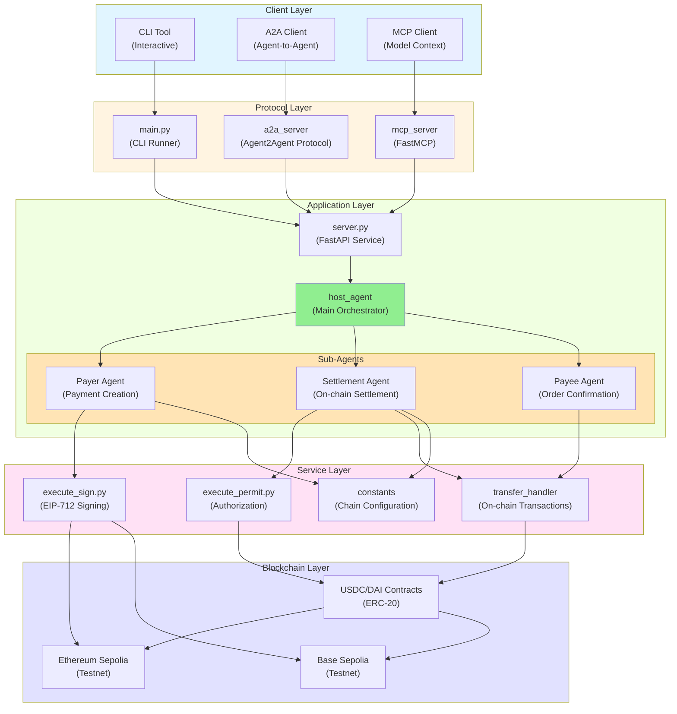

# Zen7 Payment Agent - Development Guide

> A comprehensive guide for developers to understand, configure, and extend the Zen7 Payment Agent system.

---

## Table of Contents

1. [Environment Configuration](#1-environment-configuration)
2. [System Architecture Overview](#2-system-architecture-overview)
3. [Detailed Code Structure](#3-detailed-code-structure)
4. [Quick Start](#4-quick-start)
5. [Development Workflow](#5-development-workflow)
6. [Extension Guidelines](#6-extension-guidelines)

---

## 1. Environment Configuration

### 1.1 Prerequisites

| Component | Minimum Version | Purpose |
| --- | --- | --- |
| Operating System | Windows 10+ / Ubuntu 20.04+ | Development environment (WSL2 recommended for Windows) |
| Python | 3.13.x | Runtime interpreter for the project |
| uv | 0.4.18+ | Virtual environment and dependency management |
| Git | 2.40+ | Repository cloning and version control |
| OpenSSL | 1.1+ | Cryptographic operations and signature generation |

> **Note**: The `uv` package manager automatically downloads and manages compatible CPython versions, eliminating the need for manual Python installation.

### 1.2 Tool Installation

#### Install uv Package Manager

**Linux/macOS:**
```bash
curl -LsSf https://astral.sh/uv/install.sh | sh
```

**Windows (PowerShell):**
```powershell
irm https://astral.sh/uv/install.ps1 | iex
```

#### Enable Python Version Management
```bash
uv python install 3.13
```

#### Verify Installation
```bash
uv --version
uv python --version
```

### 1.3 Project Setup

#### Clone Repository
```bash
git clone https://github.com/Zen7-Labs/Zen7-Payment-Agent.git
cd Zen7-Payment-Agent
```

#### Create Virtual Environment
```bash
# Create isolated environment (.venv directory)
uv venv

# Activate environment
# Linux/macOS:
source .venv/bin/activate
# Windows PowerShell:
.\.venv\Scripts\Activate.ps1

# Install project dependencies
uv sync
```

> Dependencies are sourced from Aliyun mirror and official PyPI. You can adjust sources in `pyproject.toml`.

### 1.4 Environment Variables

#### Create Configuration File
```powershell
# Copy template
Copy-Item .env.example .env -Force
```

#### Essential Configuration Parameters

| Variable | Required | Description |
| --- | --- | --- |
| `GOOGLE_API_KEY` | ✅ | Google Generative AI access key for Gemini models |
| `GOOGLE_GENAI_USE_VERTEXAI` | ⬜ | Enable VertexAI (`TRUE`/`FALSE`) |
| `PAYER_PRIVATE_KEY` | ✅ | Payer signing private key (testnet only) |
| `SETTLEMENT_PRIVATE_KEY` | ✅ | Settlement private key (testnet only) |
| `SPENDER_WALLET_ADDRESS` | ✅ | Backend wallet address for permit spender |
| `ZEN7_PAYMENT_SERVER_HOST` | ✅ | FastAPI service binding address (default: `localhost`) |
| `ZEN7_PAYMENT_SERVER_PORT` | ✅ | FastAPI service port (default: `8080`) |
| `CHAIN_SELECTION` | ✅ | Target blockchain network (`SEPOLIA` or `BASE_SEPOLIA`) |
| `SEPOLIA_CHAIN_RPC_URL` | ✅ | Ethereum Sepolia RPC endpoint (Infura/Alchemy) |
| `SEPOLIA_USDC_ADDRESS` | ✅ | Testnet USDC contract address |
| `SEPOLIA_DAI_ADDRESS` | ⬜ | Testnet DAI contract address (if using DAI) |
| `BASE_SEPOLIA_CHAIN_RPC_URL` | ⬜ | Base Sepolia RPC endpoint (if using Base network) |
| `BASE_SEPOLIA_USDC_ADDRESS` | ⬜ | Base Sepolia USDC contract address |
| `NOTIFICATION_URL` | ⬜ | Payment result notification callback URL |
| `ACTIVE_TOKEN` | ✅ | Active token for payments (`USDC` or `DAI`) |

> **Security Warning**: Never use real private keys in production. Use key management services or CI/CD secret injection for sensitive values.

---

## 2. System Architecture Overview

### 2.1 High-Level Architecture

The Zen7 Payment Agent is built on a multi-agent architecture leveraging Google's ADK (Agent Development Kit) and supports multiple protocol interfaces (A2A and MCP).

#### Architecture Diagram




### 2.2 Core Components

#### 2.2.1 Multi-Agent System

**Host Agent** (`host_agent/agent.py`)
- Primary orchestrator for the payment workflow
- Routes requests to specialized sub-agents
- Maintains conversation history and session state
- Uses `gemini-2.0-flash-lite` model for natural language understanding

**Sub-Agents:**

1. **Payer Agent** (`host_agent/sub_agents/payer_agent/`)
   - Creates payment orders with order number, spend amount, budget, expiration date, and currency
   - Generates EIP-712 signatures for permit authorization
   - Validates wallet balance and nonce
   - Submits payment for settlement processing

2. **Settlement Agent** (`host_agent/sub_agents/settlement_agent/`)
   - Confirms payment details (budget, expiration, currency)
   - Executes on-chain settlement transactions
   - Monitors transaction status and confirmations
   - Notifies payee agent upon successful settlement

3. **Payee Agent** (`host_agent/sub_agents/payee_agent/`)
   - Receives settlement notifications
   - Confirms order creation
   - Notifies payment initiator of completion

#### 2.2.2 Protocol Adapters

**A2A (Agent-to-Agent) Server** (`a2a_server/`)
- Implements Google's A2A protocol using `A2AStarletteApplication`
- Exposes agent capabilities as discoverable skills via `AgentCard`
- Enables inter-agent communication and collaboration
- Default port: 10000

**MCP (Model Context Protocol) Server** (`mcp_server/`)
- Uses `FastMCP` to wrap payment functionality as tool-based APIs
- Provides `proceed_payment_and_settlement_detail_info` tool
- Supports SSE (Server-Sent Events) transport
- Default port: 8015

#### 2.2.3 Service Layer

**Signing Service** (`services/execute_sign.py`)
- Implements EIP-712 typed data signing for USDC/DAI permits
- Validates private keys, nonces, and token balances
- Generates permit signatures with deadline and value parameters
- Supports both Ethereum and Base Sepolia networks

**Transfer Handler** (`services/custodial/` & `services/non_custodial/`)
- Custodial mode: Backend-managed wallet operations
- Non-custodial mode: User-controlled wallet operations
- Handles permit execution and token transfers

**Constants** (`services/constants.py`)
- Centralized blockchain configuration
- Chain IDs, RPC URLs, contract addresses
- Network-specific parameters

### 2.3 Data Flow

#### Payment Creation Flow
```
User Request → Host Agent → Payer Agent → 
Generate EIP-712 Signature → Return Signature → 
Update Session State → Notify User
```

#### Settlement Flow
```
Settlement Request → Settlement Agent → 
Verify Payment Details → Execute On-Chain Transaction → 
Monitor Confirmation → Notify Payee Agent → 
Create Order → Return Confirmation
```

---

## 3. Detailed Code Structure

### 3.1 Top-Level Directory Layout

| Path | Role | Description |
| --- | --- | --- |
| `main.py` | CLI Entry Point | Interactive command-line interface for local debugging with Google ADK Runner |
| `server.py` | FastAPI Server | RESTful API exposing `/chat_a2a` endpoint for external integration |
| `cli.py` | CLI Utilities | Command-line argument parsing and utilities |
| `utils.py` | Common Utilities | Session history management, event processing, terminal formatting |
| `log.py` | Logging Configuration | Centralized logger setup with file and console handlers |
| `run.sh` | Orchestration Script | Bash script to launch FastAPI and protocol services (A2A/MCP) |
| `run.ps1` | PowerShell Script | Windows-compatible orchestration script |
| `pyproject.toml` | Dependency Management | Project metadata and dependency specification (managed by `uv`) |
| `requirements.txt` | Legacy Dependencies | Traditional pip requirements file (maintained for compatibility) |

### 3.2 Entry Points and Application Layer

#### 3.2.1 `main.py` - Interactive CLI

```python
Key Components:
- InMemorySessionService: Manages session state and conversation history
- Runner: Google ADK runner for agent execution
- Initial State: order_number, spend_amount, budget, expiration_date, currency, sign_info
- Interactive Loop: Accepts user input until 'exit' or 'quit'
- History Management: Maintains interaction history via utils functions
```

**Workflow:**
1. Creates new session with initial state
2. Initializes Runner with host_agent
3. Enters input loop
4. Processes user queries through agent
5. Maintains conversation history

#### 3.2.2 `server.py` - FastAPI Service

```python
Key Components:
- FastAPI Application: RESTful API framework
- Lifespan Context: Initializes shared session service and runner
- AppWideService: Provides shared resources across requests
- Routes:
  - POST /chat_a2a: Main chat endpoint
  - GET /sessions: List all sessions
  - POST /sessions: Create new session
  - GET /sessions/{session_id}: Get session details
  - DELETE /sessions/{session_id}: Delete session
```

**Endpoint Details:**

**POST /chat_a2a**
```json
Request:
{
  "message": "string",
  "user_id": "string (optional)",
  "sign_info": "object (optional)",
  "owner_wallet_address": "string (optional)"
}

Response:
{
  "response": {
    "event": {...},
    "final_response": "string"
  }
}
```

### 3.3 Agent Architecture

#### 3.3.1 Host Agent (`host_agent/agent.py`)

**Configuration:**
- Model: `gemini-2.0-flash-lite`
- Sub-agents: payer_agent, settlement_agent, payee_agent
- Context: Includes interaction history in prompt

**Responsibilities:**
1. Query understanding and routing
2. State management across sub-agents
3. Response coordination
4. History tracking

#### 3.3.2 Sub-Agent Structure

Each sub-agent follows the pattern:
```python
from google.adk.agents import Agent

agent = Agent(
    name="agent_name",
    model="gemini-2.0-flash-lite",
    description="Agent description",
    instruction="Detailed instructions...",
    tools=[tool_function_1, tool_function_2]
)
```

**Payer Agent Tools:**
- `create_payment_order`: Initialize payment with details
- `generate_permit_signature`: Create EIP-712 signature
- `validate_balance`: Check wallet balance and nonce

**Settlement Agent Tools:**
- `confirm_payment_details`: Verify payment parameters
- `execute_settlement`: Trigger on-chain transaction
- `monitor_transaction`: Track transaction status
- `notify_payee`: Send completion notification

**Payee Agent Tools:**
- `receive_notification`: Accept settlement notification
- `create_order`: Generate order in payee system
- `notify_initiator`: Confirm to payment initiator

### 3.4 Protocol Adaptation Layer

#### 3.4.1 A2A Server (`a2a_server/`)

**agent.py:**
```python
process_with_content_agent: Agent wrapper for A2A
- Tool: proceed_payment_and_settlement_and_order_info
- Sends requests to FastAPI server at ZEN7_PAYMENT_SERVER_BASE_URL
```

**agent_executor.py:**
```python
ADKAgentExecutor: Maps external A2A requests to host_agent
- Implements executor interface for A2A protocol
- Handles state management and session context
```

**__main__.py:**
```python
A2AStarletteApplication setup:
- AgentCard: Describes agent capabilities
- AgentSkill: Defines available skills
- Uvicorn server: Runs A2A protocol server
```

#### 3.4.2 MCP Server (`mcp_server/`)

**__main__.py:**
```python
FastMCP application:
- Tool: proceed_payment_and_settlement_detail_info
- Parameters: message, user_id, sign_info, owner_wallet_address
- Transport: SSE (Server-Sent Events)
- Click CLI: Command-line interface for server configuration
```

### 3.5 Service Layer

#### 3.5.1 Signing Service (`services/execute_sign.py`)

**Core Functionality:**
```python
1. EIP-712 Typed Data Structure:
   - Domain: name, version, chainId, verifyingContract
   - Types: Permit(owner, spender, value, nonce, deadline)
   - Message: Actual permit parameters

2. Signature Generation:
   - Encode typed data using eth_account
   - Sign with private key
   - Return v, r, s signature components

3. Validations:
   - Private key format and length
   - Wallet balance sufficiency
   - Nonce retrieval from contract
   - Deadline timestamp conversion
```

**Supported Tokens:**
- USDC (version 2)
- DAI (version 1)

**Network Support:**
- Ethereum Sepolia (Chain ID: 11155111)
- Base Sepolia (Chain ID: 84532)

#### 3.5.2 Constants Configuration (`services/constants.py`)

Provides centralized configuration for:
- Chain IDs and hex representations
- RPC endpoint URLs
- Token contract addresses
- Network parameters

#### 3.5.3 Transfer Handlers

**Custodial Mode** (`services/custodial/`)
- Backend wallet manages private keys
- Simplified user experience
- Higher trust requirement

**Non-Custodial Mode** (`services/non_custodial/`)
- User controls private keys
- Enhanced security
- Requires wallet integration

### 3.6 Utilities and Logging

#### 3.6.1 `utils.py`

**Key Functions:**

```python
add_user_query_to_history(session_id, user_input, session_service)
- Appends user message to session history

update_interaction_history(session_id, role, content, session_service)
- Maintains formatted interaction history in session state

call_agent_async(runner, session_id, user_input)
- Wraps Runner.run_async for agent execution
- Processes streaming events
- Returns formatted response

process_agent_response(event)
- Converts Event to structured response
- Handles terminal color formatting
```

#### 3.6.2 `log.py`

**Logger Configuration:**
```python
- Format: [%(asctime)s] %(levelname)s - %(message)s
- Handlers:
  - Console: INFO level with color support
  - File (logs/server.log): DEBUG level
  - Error File (logs/errors.log): ERROR level
- Rotation: Logs rotate to preserve history
```

### 3.7 Scripts and Orchestration

#### 3.7.1 `run.sh` (Bash)

```bash
Usage: ./run.sh [a2a|mcp] --host <host> --port <port>

Features:
- Argument parsing for protocol selection
- Automatic service startup coordination
- Environment variable injection
- Process management
```

#### 3.7.2 `run.ps1` (PowerShell)

Windows-compatible version of orchestration script with equivalent functionality.

---

## 4. Quick Start

For immediate setup and first-run instructions, please refer to our dedicated [Quick Start Guide](quick_start.md).

The quick start guide covers:
- Fast track environment setup
- Repository cloning and dependency installation
- Running the application in different modes (CLI, API, A2A, MCP)
- First payment transaction walkthrough
- Common troubleshooting steps

---

## 5. Development Workflow

### 5.1 Development Commands

| Task | Command |
| --- | --- |
| Start Interactive CLI | `uv run python main.py` |
| Start FastAPI Server | `uv run python server.py` |
| Start A2A Server | `uv run a2a_server --host 127.0.0.1 --port 10000` |
| Start MCP Server | `uv run mcp_server --host 127.0.0.1 --port 8015` |
| Orchestrated Startup (A2A) | `./run.sh a2a --host 127.0.0.1 --port 10000` |
| Orchestrated Startup (MCP) | `./run.sh mcp --host 127.0.0.1 --port 8015` |

### 5.2 API Testing

#### Using cURL

```bash
# Chat with agent
curl -X POST http://localhost:8080/chat_a2a \
  -H "Content-Type: application/json" \
  -d '{"message": "Create a payment for order #12345 with amount 100 USDC"}'

# List sessions
curl http://localhost:8080/sessions

# Create new session
curl -X POST http://localhost:8080/sessions \
  -H "Content-Type: application/json" \
  -d '{"user_id": "test_user"}'
```

#### Using Python Requests

```python
import requests

# Chat endpoint
response = requests.post(
    "http://localhost:8080/chat_a2a",
    json={"message": "Create a payment for order #12345"}
)
print(response.json())
```

### 5.3 Logging and Debugging

**Log Files:**
- `logs/server.log`: Application logs (DEBUG level)
- `logs/errors.log`: Error-specific logs
- `run.log`: Script execution logs

**Enable Verbose Logging:**
```python
# In your code
import logging
logging.getLogger().setLevel(logging.DEBUG)
```

**View Real-Time Logs:**
```bash
# Linux/macOS
tail -f logs/server.log

# Windows PowerShell
Get-Content logs/server.log -Wait
```

### 5.4 Testing

Currently, the repository does not include automated tests. We recommend:

**Add pytest:**
```bash
uv add --dev pytest pytest-asyncio httpx
```

**Create test structure:**
```
tests/
  __init__.py
  test_agents.py
  test_services.py
  test_api.py
  conftest.py
```

**Example test:**
```python
# tests/test_api.py
import pytest
from fastapi.testclient import TestClient
from server import app

client = TestClient(app)

def test_chat_endpoint():
    response = client.post(
        "/chat_a2a",
        json={"message": "Hello"}
    )
    assert response.status_code == 200
    assert "response" in response.json()
```

**Run tests:**
```bash
uv run pytest tests/
```

---

## 6. Extension Guidelines

### 6.1 Adding New Sub-Agents

1. **Create agent directory:**
```
host_agent/sub_agents/new_agent/
  __init__.py
  agent.py
```

2. **Define agent in `agent.py`:**
```python
from google.adk.agents import Agent
from google.adk.tools import ToolContext

def custom_tool(param: str, tool_context: ToolContext) -> str:
    """Tool implementation"""
    return "result"

new_agent = Agent(
    name="new_agent",
    model="gemini-2.0-flash-lite",
    description="New agent description",
    instruction="Detailed instructions...",
    tools=[custom_tool]
)
```

3. **Register in host agent:**
```python
# host_agent/agent.py
from .sub_agents.new_agent import new_agent

host_agent = Agent(
    name="host_agent",
    # ... other config
    sub_agents=[payer_agent, settlement_agent, payee_agent, new_agent],
)
```

### 6.2 Adding New Services

1. **Create service module:**
```python
# services/new_service.py
from log import logger
from web3 import Web3

def new_service_function(param1, param2):
    """Service implementation"""
    logger.info(f"Processing {param1}")
    # Implementation
    return result
```

2. **Use in agent tools:**
```python
from services.new_service import new_service_function

def agent_tool(param: str, tool_context: ToolContext) -> str:
    result = new_service_function(param, "value")
    return result
```

### 6.3 Supporting New Blockchains

1. **Update `services/constants.py`:**
```python
# Add chain configuration
NEW_CHAIN_ID = 123456
NEW_CHAIN_ID_HEX = hex(NEW_CHAIN_ID)
NEW_CHAIN_RPC_URL = os.getenv("NEW_CHAIN_RPC_URL")
NEW_CHAIN_USDC_ADDRESS = os.getenv("NEW_CHAIN_USDC_ADDRESS")
```

2. **Update `.env.example`:**
```bash
# New Chain Configuration
NEW_CHAIN_RPC_URL=https://rpc.newchain.io
NEW_CHAIN_USDC_ADDRESS=0x...
```

3. **Add chain selection logic:**
```python
# services/constants.py
CHAIN_SELECTION = os.getenv("CHAIN_SELECTION", "SEPOLIA")

if CHAIN_SELECTION == "NEW_CHAIN":
    CHAIN_ID = NEW_CHAIN_ID
    CHAIN_RPC_URL = NEW_CHAIN_RPC_URL
    USDC_ADDRESS = NEW_CHAIN_USDC_ADDRESS
```

### 6.4 Adding New Token Support

1. **Configure token parameters:**
```python
# services/execute_sign.py
NEW_TOKEN_ADDRESS = os.getenv("NEW_TOKEN_ADDRESS")
NEW_TOKEN_NAME = "NewToken"
NEW_TOKEN_VERSION = "1"
```

2. **Update EIP-712 domain:**
```python
if ACTIVE_TOKEN == "NEW_TOKEN":
    USDC_ADDRESS = Web3.to_checksum_address(NEW_TOKEN_ADDRESS)
    USDC_NAME = NEW_TOKEN_NAME
    USDC_VERSION = NEW_TOKEN_VERSION
```

3. **Add token-specific validation:**
```python
def validate_token_balance(token_address, wallet_address, amount):
    token_contract = w3.eth.contract(address=token_address, abi=ERC20_ABI)
    balance = token_contract.functions.balanceOf(wallet_address).call()
    return balance >= amount
```

### 6.5 Custom Protocol Adapters

To add support for additional protocols beyond A2A and MCP:

1. **Create protocol directory:**
```
custom_protocol_server/
  __init__.py
  __main__.py
  adapter.py
```

2. **Implement adapter:**
```python
# custom_protocol_server/adapter.py
import requests
import os

class CustomProtocolAdapter:
    def __init__(self):
        self.base_url = f"http://{os.getenv('ZEN7_PAYMENT_SERVER_HOST')}:{os.getenv('ZEN7_PAYMENT_SERVER_PORT')}"
    
    def send_message(self, message: str) -> dict:
        response = requests.post(
            f"{self.base_url}/chat_a2a",
            json={"message": message}
        )
        return response.json()
```

3. **Create entry point:**
```python
# custom_protocol_server/__main__.py
from .adapter import CustomProtocolAdapter

def main():
    adapter = CustomProtocolAdapter()
    # Protocol-specific server setup
    
if __name__ == "__main__":
    main()
```

4. **Update orchestration scripts:**
```bash
# run.sh
if [ "$1" == "custom" ]; then
    uv run custom_protocol_server --host $HOST --port $PORT
fi
```

### 6.6 Best Practices

#### Code Organization
- Keep agents focused on single responsibilities
- Extract reusable logic into services
- Use type hints for better IDE support
- Document complex functions with docstrings

#### Error Handling
```python
from log import logger

try:
    result = risky_operation()
except SpecificException as e:
    logger.error(f"Operation failed: {e}")
    return {"error": str(e)}
except Exception as e:
    logger.exception("Unexpected error")
    raise
```

#### Configuration Management
- Use environment variables for all configurable values
- Provide sensible defaults
- Document all variables in `.env.example`
- Never commit sensitive values to version control

#### Testing Strategy
- Write unit tests for services
- Integration tests for agent workflows
- Mock external dependencies (blockchain, APIs)
- Test error scenarios

#### Documentation
- Update this guide when adding major features
- Maintain example conversations in `docs/`
- Keep `code_structure.md` in sync with changes
- Document API changes in separate changelog

---

## Appendix

### A. Related Documentation

- [Quick Start Guide](quick_start.md) - Fast setup and first run
- [Environment Setup](environment_setup.md) - Detailed environment configuration
- [Code Structure](code_structure.md) - Architecture deep dive (Chinese)
- [Blockchain Setup](blockchain_environment_setup.md) - Testnet configuration
- [Deployment Guide](deployment_guide.md) - Production deployment instructions

### B. Useful Resources

- [Google ADK Documentation](https://github.com/google/agent-development-kit)
- [FastAPI Documentation](https://fastapi.tiangolo.com/)
- [Web3.py Documentation](https://web3py.readthedocs.io/)
- [EIP-712 Specification](https://eips.ethereum.org/EIPS/eip-712)
- [USDC Contract Documentation](https://developers.circle.com/stablecoins/docs)

### C. Common Issues and Solutions

**Issue: Module not found errors**
```bash
# Solution: Ensure virtual environment is activated and dependencies are installed
source .venv/bin/activate  # or .\.venv\Scripts\Activate.ps1
uv sync
```

**Issue: Private key validation fails**
```bash
# Solution: Ensure private key is 64 hex characters (66 with 0x prefix)
# Check .env file format
```

**Issue: RPC connection timeouts**
```bash
# Solution: Verify RPC URL is correct and accessible
curl $SEPOLIA_CHAIN_RPC_URL
# Consider using alternative RPC providers
```

**Issue: Agent responses are slow**
```bash
# Solution: Check GOOGLE_API_KEY quota and rate limits
# Consider using VertexAI for production workloads
```

### D. Contributing

When contributing to this project:

1. Fork the repository
2. Create a feature branch
3. Make your changes with tests
4. Update documentation
5. Submit a pull request with detailed description

Please ensure:
- Code follows existing style conventions
- All tests pass
- Documentation is updated
- Commit messages are descriptive

---

## Citation

If you find Zen7 Payment Agent helpful in your research or project, please cite it as:

```bibtex
@misc{zen7paymentagent,
  author = {Zen7 Labs},
  title = {Zen7 Payment Agent: AI-Powered Blockchain Payment Service},
  year = {2025},
  publisher = {GitHub},
  url = {https://github.com/Zen7-Labs/Zen7-Payment-Agent}
}
```

## License

Apache License Version 2.0
